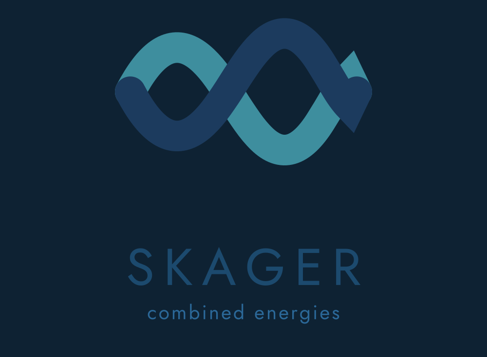

<!DOCTYPE html>
<html lang="nl">
<head>
<meta charset="utf-8">
<meta name="viewport" content="width=device-width, initial-scale=1">
<title>Over Skager — combined energies</title>
<meta name="description" content="Over Skager: twee specialisten — thermische systemen en elektrotechniek — één geïntegreerde aanpak.">
<meta property="og:title" content="Over Skager — combined energies">
<meta property="og:description" content="Over Skager: twee specialisten — thermische systemen en elektrotechniek — één geïntegreerde aanpak.">
<meta property="og:type" content="website">
<meta property="og:image" content="assets/icon_square_512px.png">
<link rel="preconnect" href="https://fonts.googleapis.com">
<link href="https://fonts.googleapis.com/css2?family=Jost:wght@300;400;500;600&amp;family=IBM+Plex+Mono:wght@400;500&amp;display=swap" rel="stylesheet">

<link rel="icon" href="assets/favicon.ico" sizes="any">
<link rel="icon" type="image/png" sizes="32x32" href="assets/favicon_32px.png">
<link rel="apple-touch-icon" href="assets/apple-touch-icon.png">
<link rel="stylesheet" href="assets/responsive.css">
</head>
<body>

  
  

    <a href="diensten.html" style="text-decoration:none;color:rgba(238,243,246,.75)">Diensten</a>
    <a href="aanpak.html" style="text-decoration:none;color:rgba(238,243,246,.75)">Aanpak</a>
    <a href="over.html" style="text-decoration:none;color:#eef3f6;font-weight:500;border-bottom:1px solid #3e8e9e;padding-bottom:4px">Over</a>
    <a href="contact.html" style="text-decoration:none;border:1px solid #3e8e9e;color:#7fc2ce;padding:8px 22px;margin:-9px 0">Contact</a>
  

  
OVER SKAGER

  <h1 style="margin:0;font-size:54px;line-height:1.1;font-weight:400;max-width:780px;text-wrap:pretty">Twee specialisten, één geïntegreerde aanpak.</h1>
  
Wij helpen organisaties de complexiteit op het raakvlak van warmte en elektriciteit te ontwarren en te benutten — met onafhankelijk advies, diepgaande technische kennis en oog voor haalbaarheid.

  
ONZE VISIE

  
Een wereld waarin warmte en elektriciteit als één slim systeem worden beheerd, zodat energie efficiënt, betrouwbaar en duurzaam beschikbaar is voor iedereen.

  

    <x-import component-from-global-scope="image-slot" from="./image-slot.js" id="founder-a" shape="circle" style="width:96px;height:96px" placeholder="Foto oprichter A" hint-size="96px,96px"></x-import>
    
Mede-oprichter — Thermische systemen

    
Warmtenetten, warmtepompen en power-to-heat. Acquisitie gericht op industrie en woningcorporaties.

  

  

    <x-import component-from-global-scope="image-slot" from="./image-slot.js" id="founder-b" shape="circle" style="width:96px;height:96px" placeholder="Foto oprichter B" hint-size="96px,96px"></x-import>
    
Mede-oprichter — Elektrotechniek &amp; netbeheer

    
Netcapaciteit, opslag en energiemanagement. Acquisitie gericht op gemeenten en projectontwikkelaars.

  

  <h2 style="margin:0 0 36px;font-size:30px;font-weight:400">Waarom als duo</h2>
  

    
—Snellere geloofwaardigheid bij grotere opdrachtgevers.

    
—Complementaire kennisgebieden: thermische systemen én elektrotechniek.

    
—Spreiding van acquisitie via twee netwerken.

    
—Financieel risico gedeeld, lagere druk op individuele cashflow.

  

  <a href="contact.html" style="text-decoration:none;display:inline-block;background:#3e8e9e;color:#0e2233;padding:16px 40px;font-size:17px;font-weight:500">Plan een kennismaking</a>

  Skager BV — combined energies
  skager.eu · info@skager.eu

</body>
</html>
